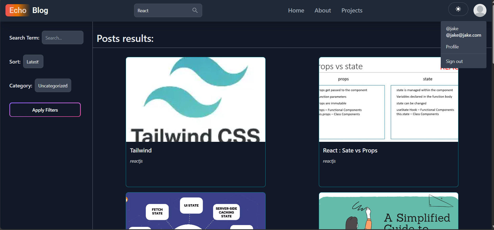
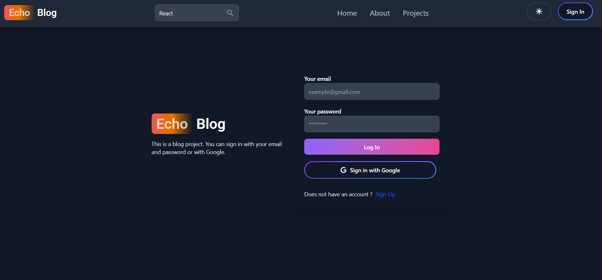

# MERN Blog Project

## Overview

This project is a full-stack blog application built using the MERN stack (MongoDB, Express.js, React.js, Node.js). It allows users to create, read, update, and delete blog posts, as well as comment on them. The application includes features such as user authentication, authorization, and a dashboard for administrators to manage content.

## Table of contents

- [Features](#features)
- [Client Technology](#client)
- [Server Technology](#server)
- [Project Structure](#project-structure)
- [Setup](#setup)
- [Api Endpoints](#api-endpoints)
- [📸Screenshots](#📸-screenshots)
- [Contribution](#contributing)

## Features

-   **User Authentication:** Secure user registration and login using JWT.
-   **Post Management:** Create, read, update, and delete blog posts.
-   **Commenting System:** Users can comment on blog posts.
-   **Admin Dashboard:** A dedicated dashboard for administrators to manage users, posts, and comments.
-   **Rich Text Editor:** Utilizes Jodit Editor for creating and editing post content.
-   **Responsive Design:** The application is designed to be responsive and accessible on various devices.
-   **Theme Support:** Dark and light theme support using Redux for state management.
-   **OAuth:** Google OAuth for easy signup and signin.

## Technologies

### Client

-   **React.js:** A JavaScript library for building user interfaces.
-   **Vite:** A build tool that provides a fast and efficient development experience.
-   **Tailwind CSS:** A utility-first CSS framework for styling the application.
-   **Flowbite React:** A UI component library for React.
-   **Redux Toolkit:** For managing application state.
-   **React Router DOM:** For handling client-side routing.
-   **Jodit Editor:** A WYSIWYG editor for creating and editing blog post content.
-   **Axios:** For making HTTP requests.
-   **js-cookie:** For handling cookies.
-   **Moment.js:** For formatting dates.

### Server

-   **Node.js:** A JavaScript runtime built on Chrome's V8 JavaScript engine.
-   **Express.js:** A web application framework for Node.js.
-   **MongoDB:** A NoSQL database.
-   **Mongoose:** An ODM (Object-Document Mapper) for MongoDB and Node.js.
-   **bcryptjs:** For hashing passwords.
-   **jsonwebtoken:** For creating and verifying JWT tokens.
-   **dotenv:** For loading environment variables from a `.env` file.
-   **cookie-parser:** For parsing cookies.
-   **colors:** For adding colors to console logs.

## Project Structure

### Client (`/client`)
- `src/components/` - Reusable UI components
- `src/pages/` - Route pages
- `src/redux/` - Redux store and slices
- `public/` - Static assets
- `.env` - Environment variables

### Server (`/api`)
- `controllers/` - Route handlers
- `models/` - Mongoose models
- `routes/` - API routes
- `middlewares/` - Express middlewares
- `config/` - DB config
- `utils/` - Utility functions
- `.env` - Environment variables

## Setup

### Prerequisites
- Node.js
- npm or yarn
- MongoDB

### Installation

1. Clone the repository:
   ```bash
    git clone https://github.com/your-username/echo-blog.git
    cd echo-blog

   ```

2. Install dependencies
    #### Client
    ```
    cd client
    npm install
    ```

    #### Server
    ```
    cd ../server
    npm install
    ```

3. Configure server `.env`:
   ```env
   PORT=8080
   MONGO_URI=<your-mongodb-uri>
   SECRET=<your-secret-key>
   GOOGLE_CLIENT_ID=<your-google-client-id>
   GOOGLE_CLIENT_SECRET=<your-google-client-secret>
   ```

4. Run the app
    #### Start backend
    ```
    cd server
    npm run dev
    ```

    #### Start frontend
    ```
    cd ../client
    npm run dev
    ```


## API Endpoints
- `POST /api/auth/signup` - Register
- `POST /api/auth/signin` - Login
- `POST /api/auth/google` - Google OAuth
- `POST /api/user/update/:id` - Update profile
- `DELETE /api/user/delete/:id` - Delete account
- `POST /api/post/create` - Create post
- `GET /api/post/getposts` - Get posts
- `PUT /api/post/updatepost/:postId` - Update post
- `DELETE /api/post/deletepost/:postId` - Delete post
- `POST /api/comment/create` - Create comment
- `GET /api/comment/getcomments` - Get comments
- `PUT /api/comment/editComment/:commentId` - Edit comment
- `DELETE /api/comment/deleteComment/:commentId` - Delete comment

## 📸 Screenshots

<details> <summary><strong>🏠 Home & Navigation</strong></summary>

   

</details>

<details> <summary><strong>📝 Blog Features</strong></summary>

   


</details>

<details> <summary><strong>👤 User Profiles</strong></summary>

 

</details>

<details> <summary><strong>📊 Admin Dashboard</strong></summary>

 

</details>

<details> <summary><strong>🔐 Authentication</strong></summary>

 

</details>


## Contributing

Contributions are welcome! Please follow these steps:

1.  Fork the repository.
2.  Create a new branch for your feature or bug fix.
3.  Make your changes and commit them.
4.  Submit a pull request.

## License

[MIT](LICENSE)